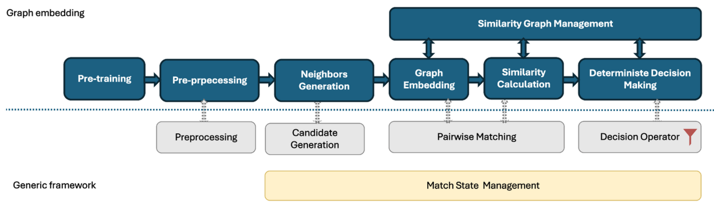
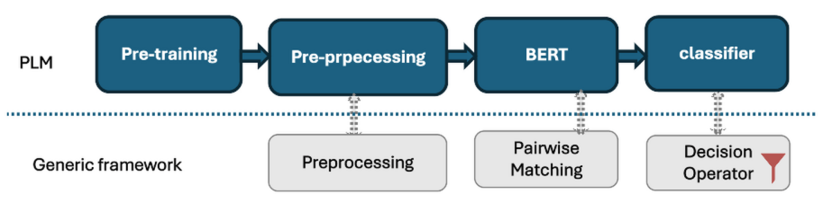
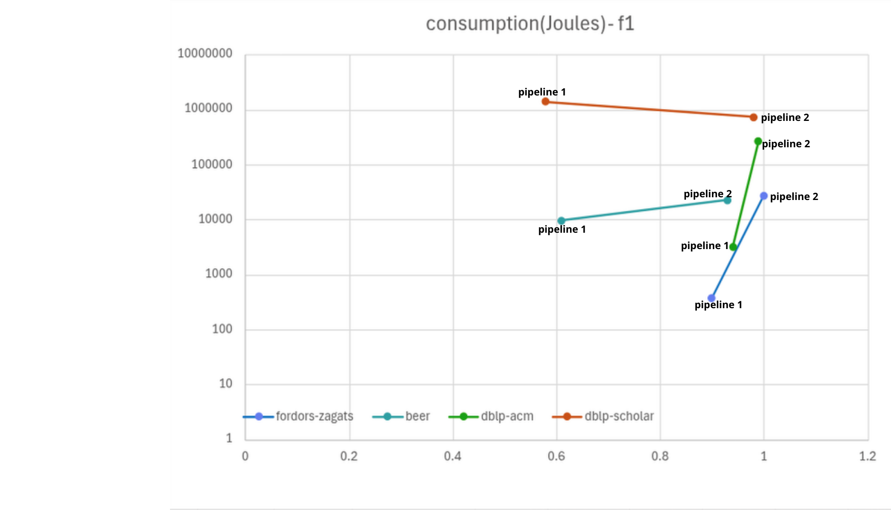
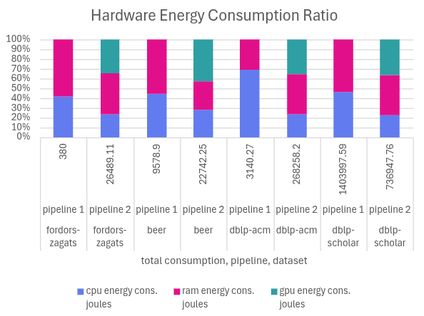
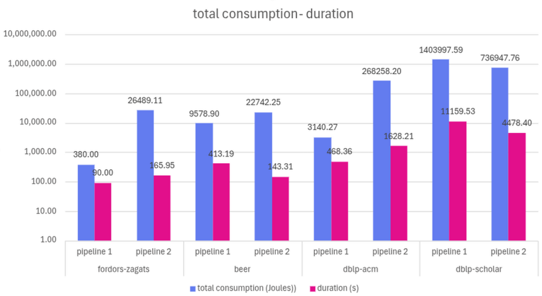

# Energy-Aware and Generic Framework for ER
We implement the one graph embedding and one LLM as examples to show the feasibility of our framework.

## About the experiments
### Datasets
 We use the [open-source datasets](https://github.com/anhaidgroup/deepmatcher/blob/master/Datasets.md created from real-world data and are dedicated to the entity resolution task.

 | Dataset         | Attributes                                                | Description                 | Record Pairs | Matches | Match Rate | Size |
|----------------|------------------------------------------------------------|-----------------------------|---------|------------|-----------------|----------------|
| fordors-zagats | name, addr, city, phone, type, class                       | Restaurant information      | 946     | 110  | 11.63%    | 168 KiB         | 
| beer           | beer_name, brew_factory_name, style, abv                   | Beer products information    | 450    | 68  | 15.11%     | 81 KiB      |
| dblp-acm      | title, venue, year, author_1, author_2, author_3, author_4 | Scientific articles         | 12363    | 2220  | 17.96%    | 3.5 MiB      |
| dblp-scholar  | Id, title, venue, year, authors                            | Scientific articles         | 28707    | 5347    | 18.63%    | 6.6 MiB        |

### Setup
Our experiments were conducted on a server equipped with a 20-core Intel Xeon W-2155 CPU running at 3.30 GHz, 251.3 GiB of RAM, and an NVIDIA Quadro P2200 GPU.

### Metrics
- Performance: We use precision, recall, and F1-score as the primary performance metrics. 
- Energy consumption: we monitor CPU, RAM and GPU power usage (in Watts) and total energy consumption (in Joules) using the [Ecofloc](https://github.com/hhumbertoAv/ecofloc). 

### Pipeline & Configuration
- Pipeline1: incremental graph embedding

(preprocessing--candidates generation--pairwise matching--decision operator) \
To simulate the data streaming application, we take the tuples in Data Source A as the local dataset used for pre-training, and send the data from source B to kafka producer incrementally as a data stream at a regular and fixed frequency without concurrency. For each record of source B, we look for its similar values from Source A, generate the candidates and calculate the similarity. Finally, we apply a bidirectional Top-1 mutual matching strategy to determine the final match. \
For embedding, we use [gensim](https://github.com/piskvorky/gensim) pre-trained model.

- Pipeline2: PLM-based approaches

(preprocessing--pairwise matching--decision operator(classifier))\
We utilize datasets provided by previous work, adopting a 3:1:1 split for the training, validation, and test sets. The model is trained using BERT, and the experimental results are subsequently obtained.

## Match State
For the two pipelines mentioned above, we incorporate a match-state gouvernment layer without altering the original pipeline structures, based on the Match State attributes listed below:

| **Attribute** | **Format** | **Description** | **Constraints** | **Example** |
|--------------|-----------|----------------|----------------|------------|
| pair_id | tuple(string, string) | identifier of the record pair | primary key, not null | ("i_sourceA", "j_sourceB") |
| timestamp | datetime | creation time of the match state | primary key, not null | 2025-11-17T13:11:30 |
| score | float | similarity score | not null | 0.95 |
| stage | string | processing stage from which the similarity score is generated | Value set: {"PM", "CM"}, not null | "PM" |
| decision | string | decision state | Value set: {"tentative", "match"}, not null | "tentative" |
| transaction | string | transaction state | Value set: {"pending", "commit", "failed", "rolled_back", "expired"}, not null | "pending" |
| active | boolean | whether the instance is active | Value set: {true, false} | true |

## Evaluation & Results
Considering that the Pipeline 2 requires a specific dataset containing annotated data and lacks a candidate generation step, we removed the candidate generation step from Pipeline 2 to ensure comparability between the two pipelines.

Pipeline2 achieves significantly higher F1 at the cost of increased energy consumption.

For the Pipeline 1, the embedding is performed only on the CPU, Energy consumption is concentrated on the CPU and RAM.

For the Pipeline 2, we train the BERT model on the GPU. Energy consumption profile shows a significant GPU segment.
 

For dblp-scholar dataset,  Pipeline 1 ran for over 11,000 seconds with an F1 score of only 0.58, while Pipeline 2
reduced runtime by over 60% while boosting F1 to 0.98
→ This directly demonstrates that traditional pipelines are unsuitable for large-scale entity matching. A reduction in duration does not necessarily imply a decrease in total energy consumption.

