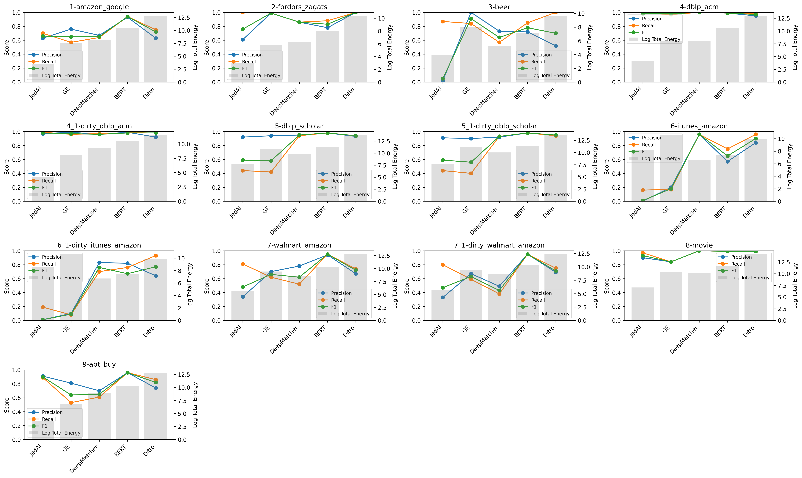

# Energy-Aware ER Project
## Experiment results 
Performance–energy comparison across methods for different datasets, where performance is depicted by line plots and and energy consumption (in Joules) is shown as gray bars on a natural logarithmic scale. Find more exact value in `stat/exp_results`.


## ER Pipeline

### 1. Overview

This project implements an entity resolution pipeline that supports two execution families:

- `embedding-*`: graph-based incremental or batch-style entity resolution with random walk embeddings, candidate generation, similarity calculation, and decision making.
- `bert-*`: sequence-pair classification with BERT-style training, inference, and evaluation.


The runtime entry point is [main_distribution.py](main_distribution.py).  
Pipeline state is managed in memory through [stateManager.py](governance/stateManager.py), and can be persisted at the end of a run.

The current implementation mixes two levels:

- pipeline modules under [pipeline](pipeline) provide reusable building blocks
- endpoint functions in [main_distribution.py](main_distribution.py) orchestrate task execution and interact with `StateManager`

### 2. quick start
1. Install packages in `requirements.txt`

2. Install pytorch
``` python
python -m pip install torch==1.13.1+cu117 torchvision==0.14.1+cu117 torchaudio==0.13.1 --index-url https://download.pytorch.org/whl/cu117
```

3. For incremental mode, set configuration file for stream simulator: delete `.example` extension of file `services/dataStreamSimulator/src/main/resources/application.properties.example`

4. Check all paths in the configuration file `config/examples/config-bert.yaml` or `config/examples/config-embedding.yaml`

5. Run the project: 
``` python
python main_distribution.py -f <config_file_path>
```

6. Get ouputs in `data/predicted`


### 3. Configuration detail
#### 3.1. Tasks

The DAG tasks are defined in [main_distribution.py](main_distribution.py).

- `normalization`
  Normalizes input records. In embedding mode it calls `index_normalization(...)`. In bert mode it converts paired data into sentence-pair format with `sequence_generating_m1(...)`.

- `graph_construction`
  Builds or updates the representation graph. When the input is a `DataFrame`, it can use [graph_construction.py](pipeline/graph_construction.py); otherwise it falls back to placeholder in-memory behavior.

- `random_walk`
  Generates walk sequences from the graph. When a real graph object is present, it uses [random_walk.py](pipeline/random_walk.py).

- `embedding_training`
  Trains or retrains the embedding model from walk sequences using [embedding_training.py](pipeline/embedding_training.py).

- `bert_training`
  Trains a BERT-style classifier using [bert_training.py](pipeline/bert_training.py).

- `cg_feature_extraction`
  Computes candidate-generation features from a `DataFrame` using [cg_feature_extraction.py](pipeline/cg_feature_extraction.py).

- `feature_index_construction`
  Builds or updates the candidate-generation index in memory using [feature_index_construction.py](pipeline/feature_index_construction.py).

- `candidate_enumeration`
  Queries the committed CG index and generates candidate pairs using [candidate_enumeration.py](pipeline/candidate_enumeration.py).

- `calculating_similarity`
  Placeholder stage in the current `main_distribution.py`. Dedicated similarity utilities live in [calculating_similarity.py](pipeline/calculating_similarity.py).

- `decision_making`
  Placeholder stage in the current `main_distribution.py`. Decision utilities live in [decision_making.py](pipeline/decision_making.py).

- `bert_inference`
  Runs inference with a saved BERT model through [bert_inference.py](pipeline/bert_inference.py).

- `evaluation`
  Current endpoint-level evaluation stage that writes result data back into `StateManager`.

- `bert_evaluation`
  Evaluates a saved BERT model through [bert_evaluation.py](pipeline/bert_evaluation.py).


#### 3.2. Modes

> Execution mode is read from `config["mode"]` in [main_distribution.py](/home/zhongwei/Data_integration/energy_aware_er/main_distribution.py).

##### Embedding Modes

- `embedding-training`
  Runs:
  `normalization -> graph_construction -> random_walk -> embedding_training -> cg_feature_extraction -> feature_index_construction`

- `embedding-inference`
  Runs:
  `normalization -> graph_construction -> random_walk -> embedding_training -> cg_feature_extraction -> feature_index_construction -> candidate_enumeration -> calculating_similarity -> decision_making`

  In the current code this mode is Kafka-oriented: it loads state once, processes buffered Kafka messages in batches, updates the same in-memory state, and saves at the end.

- `embedding-evaluation`
  Runs only the `evaluation` stage on top of loaded state.

##### BERT Modes

- `bert-training`
  Runs:
  `normalization -> bert_training`

- `bert-inference`
  Runs:
  `normalization -> bert_inference`

- `bert-b_evaluation`
  Runs:
  `normalization -> bert_evaluation`

> These tasks can also be combined, like "bert-training-b_evaluation" or "embedding-training-inference-evaluation"


#### 3.3. Core Data Structures

The current system revolves around a few central runtime objects.

- `StateManager`
  Defined in [stateManager.py](governance/stateManager.py).  
  Holds all mutable runtime state in `cache`, including graph, embedding model, candidate index, predicted matches, and evaluation results.

- `RepresentationGraph` / `DynGraphIgraph`
  Graph structures used by graph construction and random walk generation.  
  `DynGraphIgraph` is implemented in [graph_construction.py](pipeline/graph_construction.py).

- `EmbeddingModel`
  Wrapper around gensim models, implemented in [embedding_model.py](models/embedding_model.py).  
  Supports initialization, retraining, save, and load.

- `CGIndex`
  Candidate-generation index, implemented in [cg_index.py](models/cg_index.py).  
  Supports methods such as `fullindexing`, `key-blocking`, `token-blocking`, and `minhash-lsh`.

- `bert_model`
  BERT-related state is stored in cache as a dictionary containing model/trainer/tokenizer artifacts, depending on stage.

- `data_store`
  The runtime data exchange dictionary in [main_distribution.py](main_distribution.py).  
  It carries transient data such as `raw_data`, `processed_data`, `sequences`, `cg_feature`, `candidate_pairs`, and the shared `state_manager`.